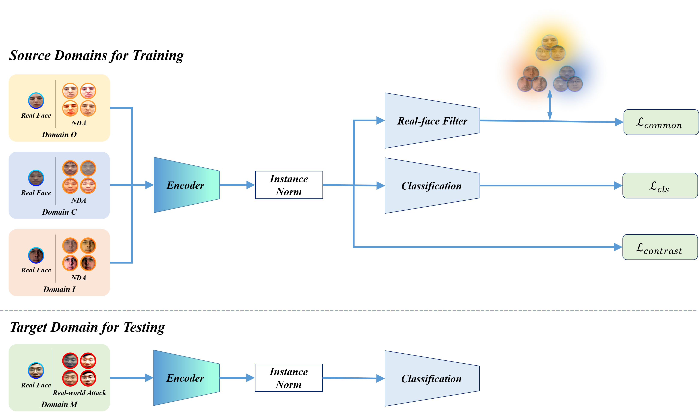
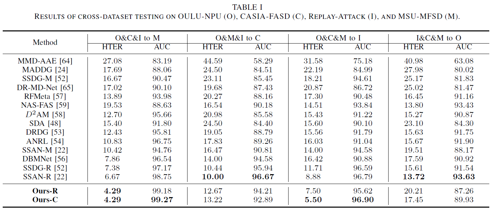

# Domain Generalization for Face Anti-Spoofing via Negative Data Augmentation


## Introduction

This repo is a python reimplementation of Domain Generalization for Face Anti-Spoofing via Negative Data Augmentation (NDA-FAS).

In this work, we use negative data augmentation (NDA) instead of real-world attack samples for training. We show that using only a few types of simple
synthesized negative samples, the learned model can achieve competitive performance over state-of-the-art DG methods trained using real-world attack
samples.
 
<div align=center>


The overall pipeline of NDA-FAS.
</div>


## Performace

We conduct experiments on four commonly used datasets for FAS, including OULU-NPU (O), CASIA-FASD (C), Idiap REPLAY-ATTACK (I), and MSU-MFSD (M).

### Results on cross-dataset testing.

- **ACER (Average Classification Error Rate)**


## Get Started

### Package Requirement

- Python 3.7
- torch 1.6.0
- opencv-python, numpy, shutil, torchvision, tqdm

### Datasets

OULU-NPU (O), CASIA-FASD (C), Idiap REPLAY-ATTACK (I), and MSU-MFSD (M).

### Training

```
python train.py --local_rank 0 --cfg configs/cfg.yaml
```

Note that for every training, you need to goto `./data/build.py` to modify the corresponding data path.

You can also find variables, such as *batch_size*, *patch_size*, *learning rate*, and *number of epoches* in the `train.py`.

In addition, you need to modify the state of TRAIN.AUTO_RESUME in `config.py` to determine whether training from scratch or finetune.


